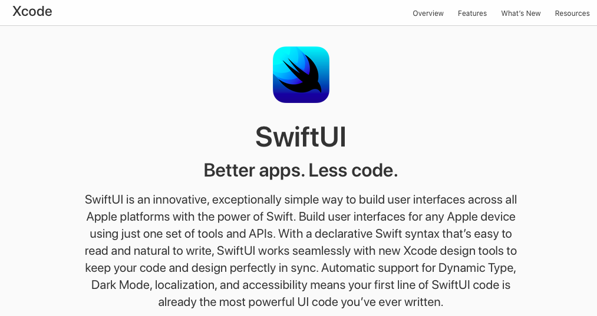

使用Apple最新的Swift UI技术编写更好的app。

随着技术的不断进步，iOS的开发语言也在不断的进步。不仅开发语言再进步，界面的开发也是历经了很多技术更新，从一开始的完全使用代码----> 到后来的xib----> 再到后来的storyboard-----> 再到现在的Swift UI，虽然现在大部分开发者还在使用storyboard，但现在Swift UI越来越成为趋势。开发人员要不断学习新的技术，精进自己的技能，用新技术编写更好应用。对与已经从事iOS开发多年的开发人员来说，学习新的技能并不难，关键是你要愿意学。

本次所学课程为美国斯坦福大学最新的iOS编程课程。使用全新的swift UI进行编写。除了Apple官方的文档，sanford 大学的iOS编程课一直是非常不错的学习教材。

本人所用开发环境：

Xcode版本：12.0

macOS版本：11.0 macOS Big Sur

Github仓库地址:https://github.com/MyColourfulLife/MySwiftUI

github仓库中的图片，您可能需要科学上网才能看得到。

第一天：

写了一个卡片demo，目前的状态是写了四个卡片，卡片的正面是个幽灵图片，卡片反面纯色背景。后续可以翻开卡片，看到卡片正面。后面会增加更多不同内容的卡片，翻开两张卡片相同加分，不同扣分。

目前做的结果如图：


知识点：

SwiftUI编写和我们使用平常使用的开发技术多少会有些不同。

```swift
struct ContentView: View {
    var body: some View {
       Text("Hello World!")
    }
}
```

第一个很有意思的是：`ContentView: View`

在面向对象编程的语言中，我们通常会说“结构体ContentView 是 一种View ”，而在这里，并不是“是”的意思，这和我们所说的继承关系不一样。在这里是说，this struct is going to behave like a View or it's going to function like a View.也就是说我们声明的这个contentView这个结构体的行为(方法)和View相似。我们知道一个View是一个矩形，有边框，背景，前景，可以触摸，缩放，响应事件等等。我们声明的这个结构体表现和View相似。


第二个很有意思的是：`var body: some View`

body是一个计算属性，类型是 some View， 意思是某种view，但并没有说是哪种View，之所以不指明是哪种View，是为了开发方便，让程序去推断返回的应该是什么类型的View。

像上面的代码那样，返回的就是 Text 这种类型的View，我们其实也可以写

```swift
 var body: Text {
       Text("Hello World!")
 }
```

但是这样我们应对不了很多情况，程序需要的内容可能是文本，也可能是图片，还可能是一堆视图的集合。因此我们并不具体指明使用哪种类型的View，而是使用 some View 来指定body的类型。


上述代码 Text之前省略了 return，这是swift语言的特性，当只有一行语句时可以省略return。


文本用 Text， 圆角矩形用 RoundedRectangle，把文本叠加在圆角矩形上，我们可以使用 ZStack，意思是垂直于屏幕摆放。

```swift
        ZStack {
            RoundedRectangle(cornerRadius: 10).fill(Color.white)
            RoundedRectangle(cornerRadius: 10).stroke(lineWidth: 3)
            Text("👻")
        }
```

构造ZStack的时候，其实是用 `ZStack(content: {})`构造的，最后一个参数是closure时，可能省略行参，打括号直接写在后面 `ZStack(){}`,当没有参数时，圆括号也可以省略，就变成了上面的样子。这个在Swift中很常见，已经用Swift开发很多年了，就不多提了，后面会经常遇到。

```swift
            RoundedRectangle(cornerRadius: 10).fill(Color.white)
```

这句话的意思是为圆角半径为10的矩形填充上白色。填充用fill，描边用stroke。之所以要加上这句话是因为在iOS dark mode 下，背景会自动填充为黑色。这不是我们想要的，所以加上了这句话，使其不管在light mode 还是 dark mode 都看起来很舒服。

HStack 、VStack 和 ZStack 都是表现像View的 视图容器，可以组合视图，视图里面的部分属性会从上层View获取属性，当然也给可以给视图直接设置属性。

```swift
 ZStack {
               RoundedRectangle(cornerRadius: 10).fill(Color.white) // 重新设置颜色为白色
            RoundedRectangle(cornerRadius: 10).stroke(lineWidth: 3) 
            Text("👻")
        }.foregroundColor(.orange)
        .font(.largeTitle)
```

上述中 第二个矩形和下面的Text都会使用ZStack的前景色，当前emoji 文本本身具有形状颜色，在这里不会重新绘制颜色。若果换成普通的文字，效果就很明显。文本的字体使用 上层的 largeTitle。


foreach的使用。这里介绍了foreach的一直使用方式

```swift
ForEach(0..<4){ index in
               GridView()
}
```

这里用range而没有用数字，执行4次，生成了四个卡片。


